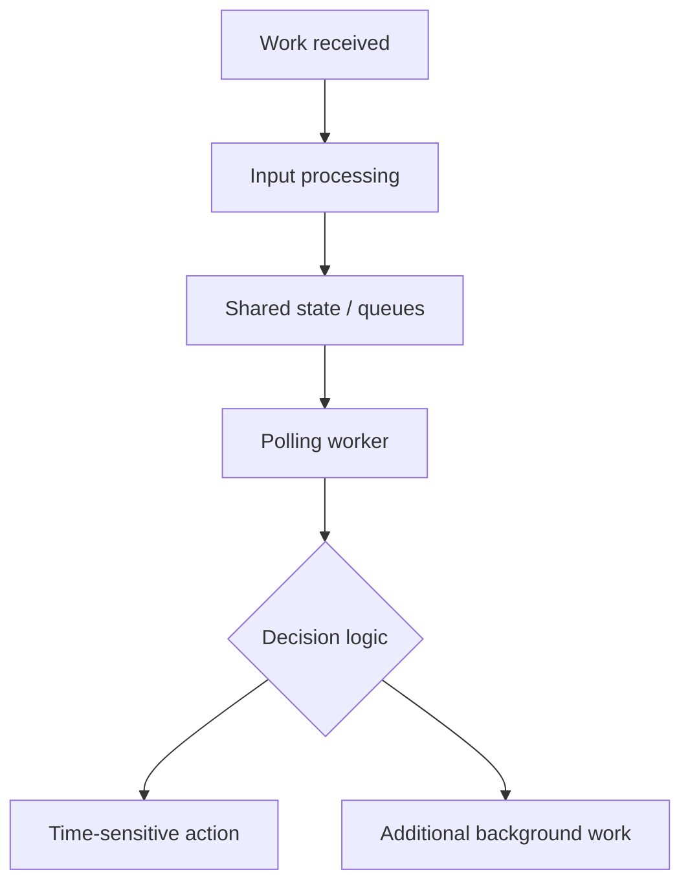
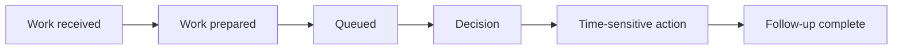
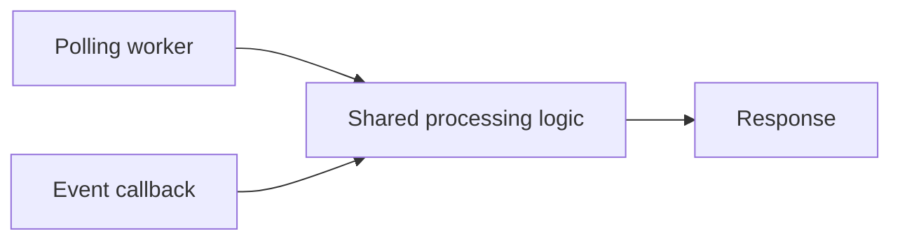
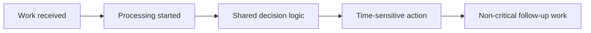
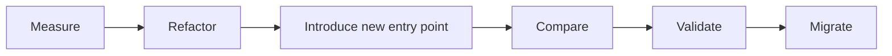

## Problem

An embedded processing path relied on periodic polling. The system was correct, but incoming work could sit until a polling cycle and several intermediate stages had completed before the first time-sensitive action began.

That was acceptable for background work. It was the wrong shape of system for a latency-sensitive event.

The obvious answer—replace polling everywhere—was also the riskiest one. The existing loop owned more than the critical path, and its decision rules were already trusted. I needed to remove avoidable waiting without quietly changing established behaviour.

## What I was working with

The application ran on embedded Linux and processed asynchronous work from several sources. In simplified form, the old path looked like this:



The polling worker also handled queue work, follow-up processing, I/O, and thread orchestration. Over time, those responsibilities had become coupled. A direct replacement would have created a large regression surface.

## Constraints that shaped the approach

- Existing behaviour had to stay the same.
- Polling and event-driven paths needed to share the same decision logic.
- A rewrite was not acceptable on a production embedded target.
- The old implementation needed to remain available while the new one was being validated.
- Improvements had to be measured, not assumed.
- The migration needed to be reversible during development.

Those constraints made an incremental migration the sensible choice.

## Find the delay before changing the design

Before changing the architecture, I added monotonic timestamps at the hand-offs that mattered. Timing individual functions would not tell me whether the delay was CPU work, queueing, scheduling, or a polling interval.

The markers covered the complete path:



The measurements showed that parts of the path were already inexpensive. The meaningful delay came from orchestration and waiting between stages, not from one slow function.

That changed the question from “what can I make faster?” to “what really needs to wait?”

## Separate the decision from the scheduling

The first step was deliberately not an event callback. It was extracting the decision logic from the polling worker.

Without that step, polling and event-driven code would each need their own version of the same rules. That is exactly the kind of migration that passes initial tests and then drifts over time. Instead, both entry points called shared processing functions:



The change was about *when* work began, not how the existing decisions were made.

## Introduce the new path beside the old one

I added the event-driven entry point alongside the polling implementation. A compile-time flag selected the active path:

```c
#if EVENT_DRIVEN_PROCESSING
    /* Event-driven processing */
#else
    /* Existing polling processing */
#endif
```

This kept the production path simple while allowing direct comparison during development. Incoming work could now start processing immediately rather than wait for the next polling iteration:



I also kept the first required reaction deliberately small. Work needed for the immediate external response stayed on the critical path; reporting and other follow-up work moved out of it where that was safe. An event-driven design still misses the point if it does everything before responding.

## The concurrency review was part of the change

Polling had hidden some timing assumptions. Triggering work immediately changed the order in which code could interact, so I reviewed shared configuration, queue ownership, object lifetime, startup ordering, mutex boundaries, thread-safe publication, and duplicate events.

The important lesson was that a performance change can expose a pre-existing concurrency defect. Execution order had to become an explicit design concern, not an accidental property of the old loop.

## Validation

I exercised both implementations with equivalent simulated workloads and compared the same timing markers:

```text
arrival → processing
processing → decision
decision → first required action
arrival → follow-up complete
```

I tested individual events and bursts. The comparison had two non-negotiable requirements:

1. **Functional equivalence** — decisions and observable behaviour had to remain consistent.
2. **Latency improvement** — the new path had to remove unnecessary waiting.

The timing instrumentation stayed separate from functional code so it could support performance testing without becoming a permanent runtime dependency.

## Result

The critical path no longer waited on polling where it did not need to. More importantly, the team could explain where latency actually came from and make an architectural change that addressed it.

The resulting design separated decision rules, execution strategy, follow-up work, and performance instrumentation. That made later performance work easier to reason about and measure.

## Trade-offs

Event-driven processing was not automatically simpler. Polling still had useful properties: simple control flow, naturally bounded execution points, and easier reasoning about some shared state.

The event-driven path provided lower response latency, less unnecessary wake-up work, and faster reaction to high-priority events. Keeping both paths temporarily increased code complexity, but it made the migration safer and the comparison honest.

## What I would carry into the next system

- Measure the whole workflow before optimising it. A fast function is irrelevant if it is waiting in a queue.
- Separate behaviour from execution strategy before changing the strategy.
- Decide what the *first* required reaction is, and keep the critical path focused on it.
- Treat timing changes as concurrency changes.
- Make a risky migration observable and reversible:



For embedded systems where regressions can have effects beyond a single code path, that controlled transition was more valuable than a faster but riskier rewrite.
